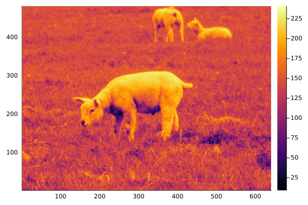
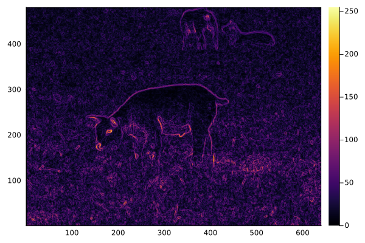
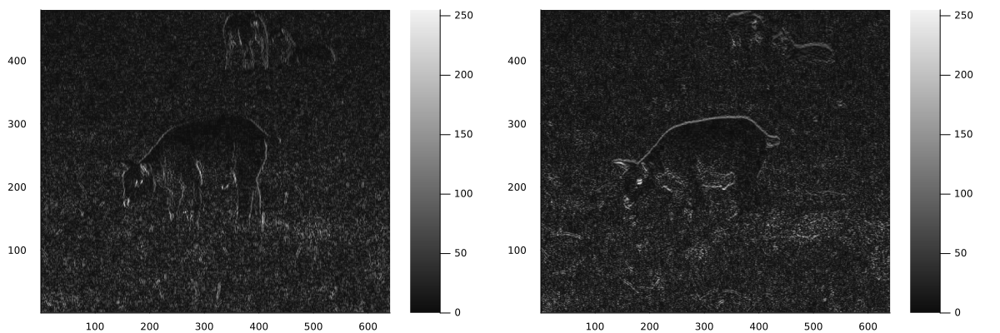
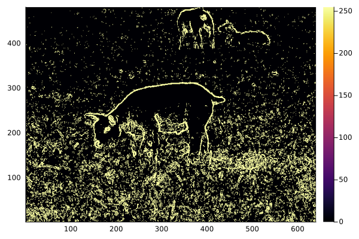

# Imports

````julia
using Pkg
Pkg.activate(".");

using Plots
using TiffImages
````

````
  Activating project at `~/Documents/GitHub/MachineVision.jl`

````

# Load Image and convert to grayscale

````julia
img = TiffImages.load("image3.tiff");
img = Float64.(Gray.(img))*255

rows   = size(img, 1)
cols   = size(img, 2)
n      = rows * cols           # total number of pixels
````

````
307200
````

# Gray Scale Image Input

````julia
p1 = Plots.heatmap(reverse(img, dims=1))
````


# Edge Detection

````julia
#=
    The Sobel operator is applied for edge detection.
=#

ximage = zeros(rows,cols)
yimage = zeros(rows,cols)
simage = zeros(rows,cols)
bimage = zeros(rows,cols)


maxim = zeros(Float32,3)
maxim[1] = 0
maxim[1] = 0
maxim[2] = 0
````

````
0
````

Calculate sobel mask for ∂E/∂x and ∂E/∂y & calculate the square gradient magnitude (edge strength)

````julia
for i in 2:rows-1
    for j in 2:cols-1

        gx = abs(
            -img[i-1, j-1] - 2*img[i, j-1] - img[i+1, j-1] + img[i-1, j+1] +  2*img[i, j+1] + img[i+1, j+1])
        maxim[1] = max(gx, maxim[1])
        ximage[i, j] = gx

        gy = abs(-img[i-1, j-1] -2*img[i-1, j] - img[i-1, j+1] + img[i+1, j-1] + 2*img[i+1, j] + img[i+1, j+1])
        maxim[2] = max(gy, maxim[2])
        yimage[i, j] = gy

        sgm = sqrt(gx^2 + gy^2)
        maxim[3] = max(sgm, maxim[3])
        simage[i, j] = sgm
    end
end
````

Normalize the images between 0 and 255

````julia
ximage .= ximage .* (255 / maxim[1])
yimage .= yimage .* (255 / maxim[2])
simage .= simage .* (255 / maxim[3])
Plots.heatmap(reverse(simage, dims = 1))
````


Create Binary Image of edge map

````julia
for i in 1:rows
    for j in 1:cols
        if simage[i, j] > 45
            bimage[i, j] = 255
        else
            bimage[i, j] = 0
        end
    end
end
````

# View the X and Y gradient images

````julia
l = @layout [a b]
p2 = Plots.plot(
    Plots.heatmap(reverse(ximage, dims=1), color=:grays),
    Plots.heatmap(reverse(yimage, dims=1), color=:grays),
    layout = l,
    size=(1200, 400)
)
````


# View the edge map

````julia
p3 = Plots.heatmap(reverse(simage, dims = 1))
````


# View the binary image

````julia
p4 = Plots.heatmap(reverse(bimage, dims = 1))
````


# Save the images

````julia
using ImageMagick

simage = round.(UInt8, simage)
bimage = convert.(UInt8, bimage)
ImageMagick.save("sgm.ras", simage)
ImageMagick.save("binaryimg.ras", bimage)
````

