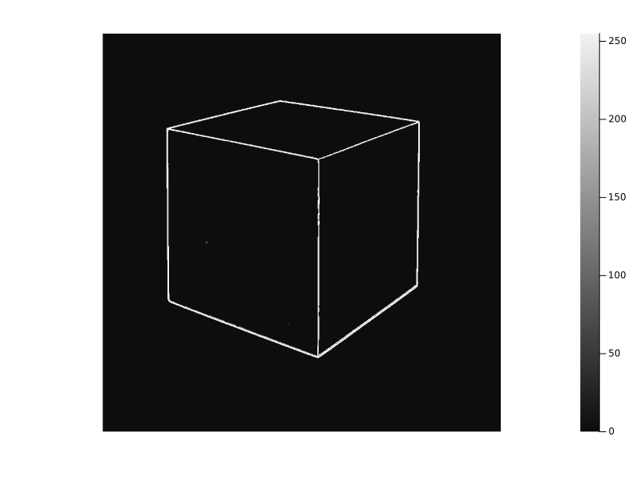
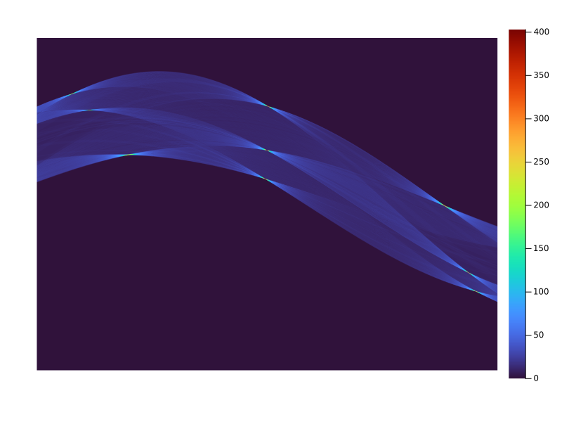
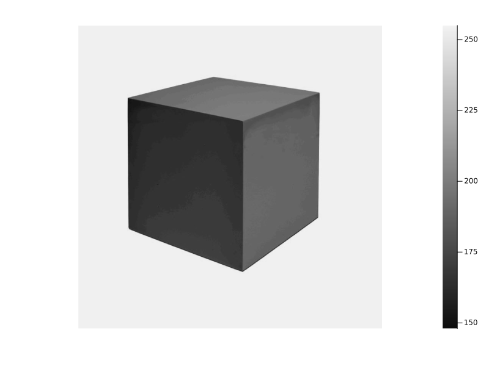

# Imports

````julia
using Pkg
Pkg.activate(".");

using Plots
using TiffImages
using Base
include("SobelMask.jl");
````

````
  Activating project at `~/Documents/GitHub/MachineVision.jl`

````

# Load Image and convert to grayscale

````julia
img = TiffImages.load("MD/image4.tiff");
img = Float64.(Gray.(img))*255;
rows   = size(img, 1);
cols   = size(img, 2);

p1 = heatmap(reverse(img), c=:grays,
aspect_ratio=:equal, axis = false, grid = false,
size = (800, 600))
````


# Get an Edge-Detected, Thresholded Image (Binary SGM)

````julia
sgmimage = CalcSobelGradients(img)[3];
threshold_value = 20;
threshimg = Threshold(sgmimage, threshold_value);

p2 = heatmap(reverse(threshimg), c=:grays,
aspect_ratio=:equal, axis = false, grid = false,
size = (800, 600))
````


# Hough Transform
Define the ρ function which defines a line in polar coordinates.

````julia
ρ(x,y,θ) = -x * sin(θ) + y * cos(θ);
````

We need to sweep through all possible θ values.

````julia
θ_values = 0:0.001:π;
````

Calculate maximum possible ρ (using the image diagonal).

````julia
ρ_max = sqrt(cols^2 + rows^2);
ρ_step = 1;
num_ρ = ceil(Int, (2 * ρ_max) / ρ_step);
````

Initialize the accumulator array.

````julia
accumulator = zeros(Int, num_ρ, length(θ_values));
````

Get the indices of all edge pixels (nonzero in the binary image).
first index gives x-axis (from left) and second gives y-axis (from bottom).

````julia
edges = findall(x -> x != 0, threshimg);
````

Loop over each edge pixel
For each θ, compute ρ and vote in the accumulator. Then shift ρ to be non-negative and quantize it.

````julia
for pixel in edges
    i, j = reverse(Tuple(pixel));
    x = i;
    y = rows- j + 1;

    for (k, θ) in enumerate(θ_values)
        ρ_val = ρ(x,y,θ)

        ρ_index = round(Int, (ρ_val + ρ_max) / ρ_step) + 1
        accumulator[ρ_index, k] += 1
    end
end;

p3 = heatmap(reverse(accumulator), c=:turbo,
aspect_ratio=:equal, axis = false, grid = false,
size = (800, 600))
````


Choose a threshold so only "strong" lines are collected

````julia
vote_threshold = 225;

all_lines = []

for ρ_idx in 1:size(accumulator, 1)
    for θ_idx in 1:size(accumulator, 2)
        vote_count = accumulator[ρ_idx, θ_idx]
        if vote_count >= vote_threshold
            θ_val = θ_values[θ_idx]
            ρ_val = (ρ_idx - 1) * ρ_step - ρ_max
            push!(all_lines, (θ_val, ρ_val, vote_count))
        end
    end
end;

println("Number of lines found: ", length(all_lines))
````

````
Number of lines found: 531

````

# Reconstruct the lines from the accumulator
1) Check intersections with x = 1 and x = cols
   y = (ρ + x*sin(θ)) / cos(θ)

2) Check intersections with y = 1 and y = rows
   x = (y*cos(θ) - ρ) / sin(θ)

We may have up to 4 intersection points.
We only need 2 distinct points for a line segment.

````julia
function get_line_endpoints(θ, ρ, cols, rows)
    points = Float64[]

    if abs(cos(θ)) > 1e-6
        y_left = (ρ + 1*sin(θ)) / cos(θ)
        if 1 <= y_left <= rows
            append!(points, [1.0, y_left])
        end

        y_right = (ρ + cols*sin(θ)) / cos(θ)
        if 1 <= y_right <= rows
            append!(points, [cols*1.0, y_right])
        end
    end

    if abs(sin(θ)) > 1e-6
        x_bottom = (1*cos(θ) - ρ) / sin(θ)
        if 1 <= x_bottom <= cols
            append!(points, [x_bottom, 1.0])
        end

        x_top = (rows*cos(θ) - ρ) / sin(θ)
        if 1 <= x_top <= cols
            append!(points, [x_top, rows*1.0])
        end
    end

    unique_pts = unique(reshape(points, 2, :), dims=2)

    if size(unique_pts, 2) >= 2
        return [unique_pts[:,1], unique_pts[:,2]]
    else
        return [unique_pts[:,1]]
    end
end
````

````
get_line_endpoints (generic function with 1 method)
````

Function to draw a line onto image: Draws each line found (above threshold).
1) Convert from bottom-left coords (x,y) to matrix row/col and clamp values to image boundaries
2) Bresenham's line algorithm to draw the line

````julia
function draw_line!(img, x0, y0, x1, y1)
    row0 = round(Int, rows - y0 + 1)
    col0 = round(Int, x0)
    row1 = round(Int, rows - y1 + 1)
    col1 = round(Int, x1)

    row0 = clamp(row0, 1, rows)
    row1 = clamp(row1, 1, rows)
    col0 = clamp(col0, 1, cols)
    col1 = clamp(col1, 1, cols)

    dx = abs(col1 - col0)
    dy = abs(row1 - row0)
    sx = col0 < col1 ? 1 : -1
    sy = row0 < row1 ? 1 : -1
    err = dx - dy
    x, y = col0, row0

    while true
        img[y, x] = 255
        if x == col1 && y == row1
            break
        end
        e2 = 2 * err
        if e2 > -dy
            err -= dy
            x += sx
        end
        if e2 < dx
            err += dx
            y += sy
        end
    end
end

reconstructed = zeros(UInt8, rows, cols);

for (θ, ρ, vote_count) in all_lines
    endpoints = get_line_endpoints(θ, ρ, cols, rows)
    if length(endpoints) == 2
        x0, y0 = endpoints[1]
        x1, y1 = endpoints[2]
        draw_line!(reconstructed, x0, y0, x1, y1)
    end
end
````

# The reconstructed lines

````julia
lines_dark = copy(img);
for r in 1:rows
    for c in 1:cols
        if reconstructed[r,c] == 0x96
            lines_dark[r,c] = 100
        end
    end
end

p4 = heatmap(reverse(lines_dark),
    c=:grays,
    aspect_ratio=:equal,
    axis=false,
    grid=false,
    size=(800, 600)
)
````


