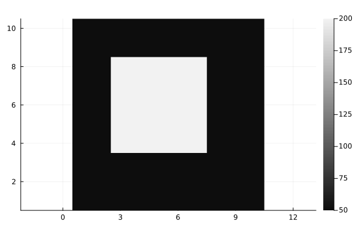
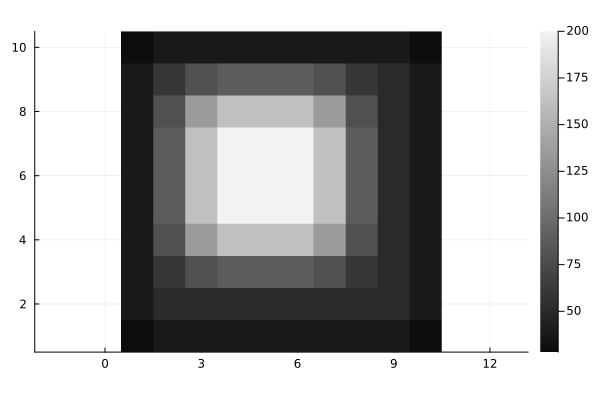
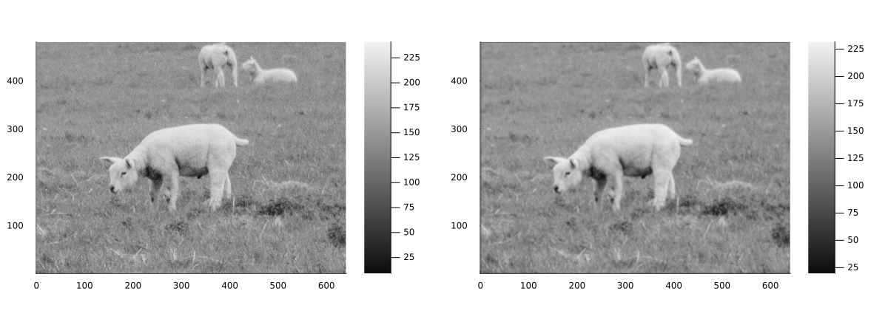
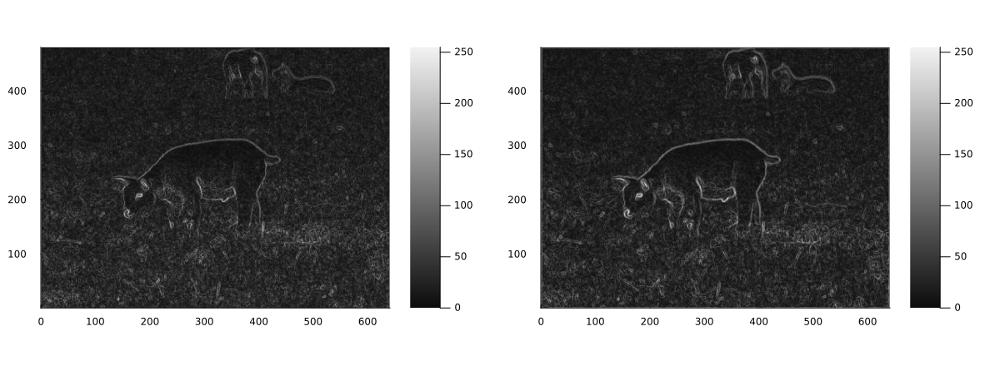
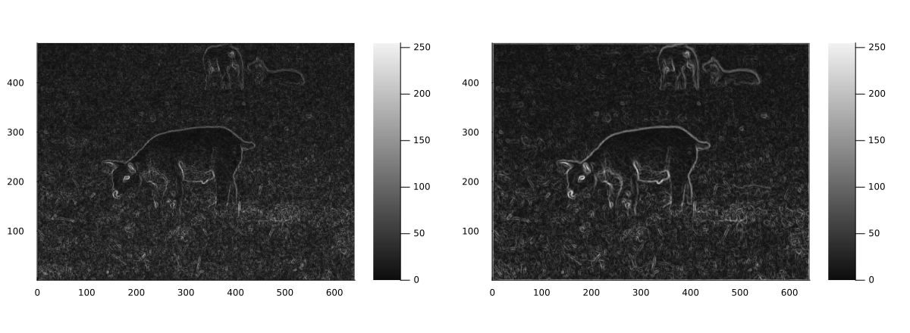
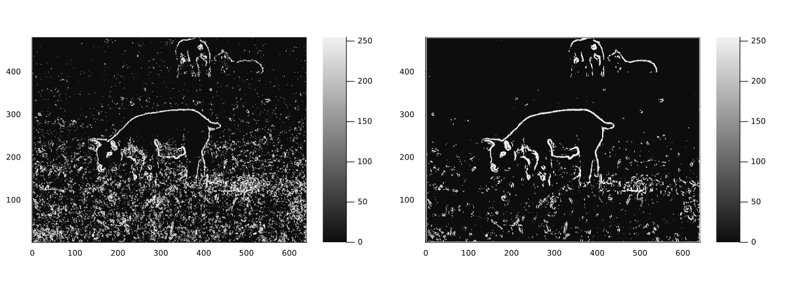

# Kernel filters and 2D Convolution is demonstrated here.
2D Convolution is an extension of 1D Convolution. It allows a kernel to be convoluted with a 2D image to apply various effects.
In this example, basic Gaussian blur kernels are used to soften the image.
Then the use case is extended to edge detection to see the effects of preprocessing an image with kernel smoothing

# Imports

````julia
using Plots
using TiffImages
````

# 2D Convolution
This is a computationally inefficient implementation of 2D Convolution but it is useful for demonstrating the concept.
A faster method would be to use the FFT method.
The image is padded such that the output image is the same size as the input image.

````julia
function Conv2D(A,B)
    imrows, imcols = size(A)
    krows, kcols = size(B)

    padRows = div(krows, 2)
    padCols = div(kcols, 2)

    padded = zeros(eltype(A), imrows + 2*padRows, imcols + 2*padCols)
    padded[padRows+1:padRows+imrows, padCols+1:padCols+imcols] = A

    output = zeros(imrows, imcols)

    for i in 1:imrows
        for j in 1:imcols
            window = padded[i:i+krows-1, j:j+kcols-1]
            output[i, j] = sum(window .* B)
        end
    end

    return output
end
````

````
Conv2D (generic function with 1 method)
````

# Example image

````julia
img = [
    50  50  50  50  50  50  50  50  50  50;
    50  50  50  50  50  50  50  50  50  50;
    50  50  200 200 200 200 200  50  50  50;
    50  50  200 200 200 200 200  50  50  50;
    50  50  200 200 200 200 200  50  50  50;
    50  50  200 200 200 200 200  50  50  50;
    50  50  200 200 200 200 200  50  50  50;
    50  50  50  50  50  50  50  50  50  50;
    50  50  50  50  50  50  50  50  50  50;
    50  50  50  50  50  50  50  50  50  50
]

p1 = heatmap(reverse(img, dims=1), aspect_ratio=1, color=:grays)
````


# Apply a Gaussian blur kernel to soften the image

````julia
kernel = [
    1/16  2/16  1/16;
    2/16  4/16  2/16;
    1/16  2/16  1/16
]

blurredimg = Conv2D(img,kernel);
p2 = heatmap(reverse(blurredimg, dims=1), aspect_ratio=1, color=:grays)
````


# Now Applying to a real image

````julia
img2 = TiffImages.load("MD/image3.tiff");
img2 = Float64.(Gray.(img2))*255;

l = @layout [a b]
p3 = Plots.plot(
    Plots.heatmap(reverse(img2, dims=1), aspect_ratio=1, color=:grays),
    Plots.heatmap(reverse(Conv2D(Conv2D(img2,kernel), kernel),dims=1), aspect_ratio=1, color=:grays),
    layout = l,
    size=(1200, 440)
)
````


The blur is subtle because the kernel only smooths an area of 3x3 pixels. A bigger kernel leads to a more pronounced blur.

# Combine this with Edge Detection

````julia
include("SobelMask.jl")

simage_vanilla = CalcSobelGradients(img2)[3];
simage_smoothed = CalcSobelGradients(Conv2D(img2,kernel))[3];
````

# Regular and Smoothed Edge Detection
There is a slight improvement in the edge detection when the image is smoothed first.

````julia
p4 = Plots.plot(
    Plots.heatmap(reverse(simage_vanilla, dims=1), aspect_ratio=1, color=:grays),
    Plots.heatmap(reverse(simage_smoothed, dims=1), aspect_ratio=1, color=:grays),
    layout = l,
    size=(1200, 440)
)
````


# Testing the effects of a bigger kernel for a more blur

````julia
kernel5x5 = [
    1  4  6  4  1;
    4 16 24 16  4;
    6 24 36 24  6;
    4 16 24 16  4;
    1  4  6  4  1
] ./ 256

simage_smoothed2 = CalcSobelGradients(Conv2D(img2,kernel5x5))[3];
````

# Edge Detection after applying a larger blur kernel looks much better

````julia
p5 = Plots.plot(
    Plots.heatmap(reverse(simage_vanilla, dims=1), aspect_ratio=1, color=:grays),
    Plots.heatmap(reverse(simage_smoothed2, dims=1), aspect_ratio=1, color=:grays),
    layout = l,
    size=(1200, 440)
)
````


# Comparing The Binary Thresholded Images
The threshold value for the smoothed image can be set higher than for the vanilla image because the contrast in the smoothed SGM image is higher.

````julia
threshold_value1, threshold_value2 = 50, 65;

bimage_vanilla = ifelse.(simage_vanilla .> threshold_value1, 255, 0);
bimage_smoothed = ifelse.(simage_smoothed2 .> threshold_value2, 255, 0);
````

# Edge Detected, Thresholded Image Versus Smoothed, Edge Detected, Thresholded Image
There is much less noise in the smoothed image.

````julia
p6 = Plots.plot(
    Plots.heatmap(reverse(bimage_vanilla, dims=1), aspect_ratio=1, color=:grays),
    Plots.heatmap(reverse(bimage_smoothed, dims=1), aspect_ratio=1, color=:grays),
    layout = l,
    size=(1200, 440)
)
````


